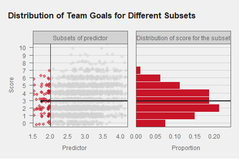

```{r setup, include=FALSE}
knitr::opts_chunk$set(echo = TRUE)
```

# Introduction

We previously used linear regression develop team ratings and predict game scores for NBA games. Linear regression is a reasonable model because NBA game scores appear to be fairly normally distributed, and the linear regression assumptions hold. 

For sports like hockey and soccer, however, assumptions for linear regression fail. Scoring in those sports more closely follows a Poisson distribution. If linear regression is used the errors are not normally distributed. Also, since scoring is low, one could imagine scenarios in which the predicted game score could be negative. For these reason, we explore alternative regression models, starting with Poisson regression. 


# Data Preparation

We start by creating data frames `db` for basketball and `dh` for hockey. 

```{r}
library(tidyverse)
library(pubtheme)
library(gganimate)
d = readRDS('data/games.rds')

## Basketball
nba = d %>% 
  filter(lg == 'nba', 
         season %in% 1990:2022, 
         season.type == 'reg') %>%
  select(date, away, home, 
         ascore, hscore, season, gid)
head(d)

da = nba %>% select(date, away, ascore, home, hscore, season, gid) %>% mutate(ha = 'away')
dh = nba %>% select(date, home, hscore, away, ascore, season, gid) %>% mutate(ha = 'home')
colnames(da) = c('date', 'team', 'score',  'opp', 'opp.score', 'season', 'gid', 'ha')
colnames(dh) = c('date', 'team', 'score',  'opp', 'opp.score', 'season', 'gid', 'ha')
db = bind_rows(da, dh) %>% 
  arrange(date, gid)
head(db)

## Hockey
nhl = d %>% 
  filter(lg == 'nhl', 
         season %in% 2012:2022, 
         season.type == 'reg') %>%
  select(date, away, home, 
         ascore, hscore, season, gid)
head(nhl)

da = nhl %>% select(date, away, ascore, home, hscore, season, gid) %>% mutate(ha = 'away')
dh = nhl %>% select(date, home, hscore, away, ascore, season, gid) %>% mutate(ha = 'home')
colnames(da) = c('date', 'team', 'score',  'opp', 'opp.score', 'season', 'gid', 'ha')
colnames(dh) = c('date', 'team', 'score',  'opp', 'opp.score', 'season', 'gid', 'ha')
dh = bind_rows(da, dh) %>% 
  arrange(date, gid)
head(dh)

```

# Data Exploration

## NBA scores 
Note that basketball scores appear fairly normally distributed

```{r}
title = 'Distribution of Team Points in NBA Games'
g  = ggplot(db, 
            aes(x = score))+
  geom_histogram(fill = pubred, 
                 color = pubbackgray, 
                 binwidth = 5) +
  labs(title = title,
       x = 'Team Points Scored in a Game', ## Required.
       y = 'Count')

g %>% 
  pub(type = 'hist')
```

```{r fig.width=6, fig.height=6}
g  = ggplot(db, 
            aes(sample = score))+
  geom_qq(color = pubred) +
  geom_qq_line() 

g %>% 
  pub(type = 'scatter')
  
```

What we actually need is that scores are normally distributed *for a given set of predictors*. Fortunately, when we used a linear regression model to predict game scores, residuals were normally distributed. 

```{r}
dm = db %>% filter(season == 2022)
lm1 = lm(score ~ 1 + ha + team + opp, 
         data = dm)

dm$pred = predict(lm1)
dm$res  = dm$score - dm$pred
title = 'Distribution of Residuals in Linear Regression Model'
g  = ggplot(dm, 
            aes(x = res))+
  geom_histogram(fill = pubred, 
                 color = pubbackgray, 
                 binwidth = 5) +
  labs(title = title,
       x = 'Residuals from Game Score Regression Model', ## Required.
       y = 'Count')

g %>% 
  pub(type = 'hist')
```


```{r}
g  = ggplot(dm, 
            aes(sample = res))+
  geom_qq(color = pubred) +
  geom_qq_line()

g %>%
  pub(type = 'scatter')
```

## NHL scores

The same is not true for NHL scores. This does not look like a normal distribution: 


```{r}
title = 'Distribution of Team Goals Scored in NHL Games'
g  = ggplot(dh, 
            aes(x = score))+
  geom_histogram(fill = pubred, 
                 color = pubbackgray, 
                 binwidth = 1) +
  labs(title = title,
       x = 'Residuals from Game Score Regression Model', ## Required.
       y = 'Count')

g %>% 
  pub(type = 'hist')

```

That however does look like a Poisson distribution. Also note that the mean and the variance are approximately equal. 

```{r}
mean(dh$score)
var(dh$score)
```

If we plot the PMF of a Poisson distribution with $lambda$ equal to that same mean `r mean(dh$score)` on top of a histogram of our data, we see they match up pretty well. 

```{r}
df = data.frame(x = 0:12, 
                y = dpois(0:12, 
                          lambda = mean(dh$score)))
df
plot(df)
```

```{r}
# ggplot(dh, aes(x=score, y=..density..))+
#   geom_histogram(binwidth=1)+
#   geom_point(data=df, aes(x=x, y=y), color='red', size=3)

ggplot(dh, 
       aes(x = score, 
           y = after_stat(density)))+
  geom_histogram(binwidth = 1)+
  geom_point(data = df, 
             aes(x = x, 
                 y = y), 
             color = 'red', 
             size = 3)

```


What we actually want to know is if NHL scores are normally distributed *for a given set of predictors,* but based on those figures it doesn't look promising. 

We'll eventually fit a simple linear regression model with a predictor that is a combination of the teams average score and the opponents average score allowed from the previous season. First, we'll compute average score and opponent score for each team.

```{r}
ds = dh %>%
  group_by(team, season) %>%
  summarise(avg.score = mean(score))
head(ds)

```
Now let's join with our data set. We want keep only the 2022 data from our data set, and we'll join the 2021 averages as extra columns. 

```{r}

dh = dh %>%
  mutate(prev.season = as.character(as.numeric(season) - 1)) %>%
  left_join(ds, 
            by=c('team', 
                 'prev.season' = 'season')) %>%
  rename(avg.score.prev = avg.score) 
head(dh)

```
SEA is a new team that didn't play in 2021, so let's remove games involving SEA.

```{r}
dh = dh %>%
  filter(team != 'SEA', 
         opp  != 'SEA')
head(dh)
```

```{r}


g %>%
  pub(type = 'scatter', 
      ybreaks = 0:10)
```


Before fitting a model, let's check that we see the relationships we expect between our predictor and outcome.

```{r}
g = ggplot(dh, 
           aes(x = avg.score.prev, 
               y = score))+
  geom_jitter(alpha  = 0.3, 
              height = 0.3)+
  

g %>% 
  pub(type = 'scatter', 
      ylim = c(0, 14), 
      xlim = c(1.8, 4.5))

```

Let's take a look at the distribution of `score` for different subsets of our predictor. It should look roughly Poisson, and it should look different for different values of $lambda$. We can bin our data using the function `cut_interval`.

```{r}
dh = dh %>%
  mutate(bin = cut_interval(avg.score.prev, 
                            length = 0.5))
head(dh)
```

Let's plot the distribution of score separately for every bin. 

```{r}


```

Hmm, it would be nice to have a vertical line showing the mean for every bin. 

```{r}
bin.means = dh %>%
  filter(!is.na(bin)) %>%
  group_by(bin) %>%
  summarise(mean.score = mean(score), 
            var.score = var(score), 
            n = n())
bin.means
```

We see that the means and variances both increase with the bins (except that the mean for (1.5,2.0] is larger than the mean for (2.0, 2.5], but maybe that's a sample size issue), and means and variances are roughly equal (except for (3.5,4.0] for some reason).  Note that if we think our outcome is roughly Poisson for every $x$, and we expect the variance to be roughly equal to the mean at each $x$, and the variance increases with the mean, then the constant variance assumption in linear regression is violated as well. 

Let's plot our histograms with the vertical lines.

```{r fig.height=6, fig.width=5}
ggplot(data = dh %>% filter(!is.na(bin)), 
       aes(x = score))+
  geom_histogram(binwidth = 1, 
                 fill = 'lightgray') + 

  
  facet_wrap(~bin, 
             ncol = 1, 
             scales = 'free_y')


```

## Animating the distribution of `score` for changing subsets

```{r}
n.frames = length(seq(1.5, 3.7, by=0.1))

## lines
dl = data.frame(left  = seq(1.5, 3.7, length=n.frames), 
                right = seq(2.0, 4.2, length=n.frames), 
                frame = 1:n.frames) %>%
  mutate(mid = left/2 + right/2)

## Stack two data frames that we want to use
## to plot in two windows 
## Give each one NAs so it doesn't show up in the other window
## This is super hack-y, but it avoids making separate animations and 
## using magick to glue them together

dl1 = dl %>% mutate(window='Subsets of predictor', 
                    end=4.2)
dl2 = dl %>% 
  mutate(window='Distribution of score for the subset', 
         left=NA, 
         right=NA, 
         mid=NA, 
         end=NA)

dl = rbind(dl1, dl2) %>%
  mutate(window = relevel(factor(window), 
                          'Subsets of predictor'))


## Gotta manually jitter, 
## otherwise the jitter will be different in each frame
dh = dh %>%
  mutate(jitter.score = jitter(score, amount=0.25))

## data for histogram and highlighted points
ddh = NULL
for(j in  dl$frame){
  left  = dl$left[j]
  right = dl$right[j]
  temp  = dh %>% 
    mutate(inside = ifelse(avg.score.prev <= right & 
                           avg.score.prev >= left, 
                           TRUE, FALSE), 
           frame = j)
  
  ddh = rbind(ddh, temp)
}

## mean of highlighted points
dm = ddh %>% 
  filter(inside==TRUE) %>%
  group_by(frame) %>%
  summarise(mean = mean(score), 
            var = var(score), 
            n = n()) %>% 
  as.data.frame()


dl = dl %>% left_join(dm, by='frame')
dl = dl %>% 
  mutate(mean.hist = ifelse(window=='Subsets of predictor', NA  , mean), 
         mean      = ifelse(window=='Subsets of predictor', mean, NA  ))

ddh2 = ddh %>% 
  mutate(hist.score = ifelse(inside==TRUE, score, NA),
         avg.score.prev = NA,
         window = 'Distribution of score for the subset') 

ddh$hist.score = NA
ddh$window = 'Subsets of predictor'
ddh = rbind(ddh, ddh2)
ddh = ddh %>% 
  mutate(window = relevel(factor(window), 
                          'Subsets of predictor'))
#ddh = ddh %>% filter(frame %in% c(1,23))

title = 'Distribution of Team Goals for Different Subsets'
g = ggplot(ddh %>% filter(frame %in% c(1:23)), 
       aes(x=avg.score.prev, 
           y=jitter.score, 
           color=inside, 
           group=gid))+
  geom_point(alpha=0.3,
             show.legend = F)+
  scale_color_manual(values = c(publightgray,
                                pubred))+
  geom_vline(data=dl %>%
               filter(frame %in% c(1:23)),
             aes(xintercept=left), 
             color=pubdarkgray)+
  geom_vline(data=dl %>%
               filter(frame %in% c(1:23)),
             aes(xintercept=right), 
             color=pubdarkgray)+
  geom_point(data = dl %>%
               filter(window=='Subsets of predictor'),
             aes(x=mid, y=mean),
             color=pubdarkgray,
             size=2,
            inherit.aes = F)+
  geom_segment(data = dl,
               aes(x=mid , xend=end,
                   y=mean, yend=mean),
               color = pubdarkgray,
               inherit.aes = F, 
               linewidth=1)+
  geom_histogram(aes(x = after_stat(density),
                     y = hist.score),
                 fill=pubred,
                 color=pubbackgray,
                 binwidth=1,
                 inherit.aes = FALSE)+
  geom_hline(data=dl, 
             aes(yintercept=mean.hist), 
             color=pubdarkgray, 
             linewidth=1)+
  facet_wrap(~window, scales='free_x')+
  scale_x_continuous(oob=squish, 
                     expand=c(0,0))+
  scale_y_continuous(limits = c(-0.5,10.5), 
                     breaks = 0:10,
                     oob=squish, 
                     expand = c(0,0))+
  labs(title    = title,
       x = 'Predictor                                                         Proportion', 
       y = 'Score')+  
  theme_pub(type='hist', base_size=36/3, facet=T) 

gg = g + 
  transition_states(frame, 
                    transition_length = 1, 
                    state_length = 0,
                    wrap=F)

# a = animate(gg, 
#             fps=10,
#             nframes = 46 + 10, 
#             height=320, 
#             width=480, 
#             end_pause=10)
# a
# 
# anim_save(a, filename = 'img/dist.of.score.for.different.subsets.gif')

```




We can see that for different subsets of our predictor, the distribution of score looks roughly Poisson, and the mean of the distribution (aka $lambda$) increases as the moving window increases and includes larger values of the predictor.  

Ok, I think that's enough data exploration. I think we've convinced ourselves that linear regression will be inappropriate and Poisson regression will be appropriate, so let's fit some models. We'll start with simple linear regression so we can have something to compare to. 

# Regression models for NHL team scores

## Linear Regression with Count Data

If we try a linear regression model to predict NHL game scores, we get reasonable results for the coefficients and predicted game scores. 

```{r}
lm1 = lm(score ~ avg.score.prev, 
         data = dh)
summary(lm1)
```

While the coefficients seem reasonable, but since the residuals aren't normally distributed, many other outputs from `summary()` that depend on that assumption (e.g. Standard Error, p-value) won't be reliable. Not surprisingly, from what we saw in the histogram of game scores, the residuals appear right-skewed.

```{r}
dh$lm1.pred = predict(lm1, newdata=dh)
dh$lm1.res  = dh$score - dh$lm1.pred
ggplot(dh, 
       aes(x = lm1.res))+
  geom_histogram()
```

## Poisson Regression using `glm`

We can use Poisson regression when out outcome is count data that follows a Poisson distribution. Let's use Poisson regression for predicting hockey game scores

```{r}

```

## Coefficients, linear vs Poisson

The coefficients in these two models are different. 

```{r}

```

Note that Poisson is a multiplicative model and the coefficients have a different interpretation from the linear regression coefficients.

## Predicted scores, linear vs Poisson

Let's check the predicted scores for these models. 

```{r}


dh$res   = dh$glm1.pred - dh$score
dh$diff1 = dh$glm1.pred - dh$lm1.pred
dh %>% 
  select(score, lm1.pred, glm1.pred, diff1) %>% 
  tail()
```

```{r}
mean(abs(dh$diff1), 
     na.rm = T)
```
The average difference between predicted scores with linear regression model vs the Poisson regression model is `mean(abs(dh$diff))`. Pretty small. Though the predicted scores are very similar for linear and Poisson regression, the assumptions for Poisson regression are much more closely met since our outcome is count data, so we prefer that model. Other outputs (standard errors, CI for coefficients, CI for predictions, etc) that depend on model assumptions are more reliable. 

Note that without `type='response'`, the `predict` code above would give predictions on the `log` scale. 


## Plotting the predictions

```{r}
ggplot(dh, 
       aes(x = avg.score.prev, 
           y = score))+
  geom_jitter(alpha  = 0.3, 
              height = 0.3, 
              color  = publightgray)+

```

In this case, the lines are pretty close, though the Poisson regression curve is more, well, curved. And again, it's not all about the prediction of the mean value. It's about the uncertainties, and the distribution of `score` for a given value of the predictor. 

## Confidence intervals for the coefficients

```{r}

```
## Confidence intervals for predictions


```{r}
predict(lm1  , newdata=dh, interval='confidence', level=.95) %>% tail()
predict(glm1 , newdata=dh, interval='confidence', level=.95, type='response') %>% tail()
```
Hmm, that's not the expected output for our glm. We'll deal with that later. 

**find pred and se.fit for 'link' then exp(), or find pred and se.fit for 'response'?**

```{r}
n = nrow(dh)
sse = sum(dh$res^2)
s2 = sse/(n-2)

sxx = sum((dh$score - mean(dh$score))^2)
s2beta1hat = s2/sxx
s2beta1hat
sbeta1hat = sqrt(s2beta1hat)
sbeta1hat

xstar = dh$avg.score.prev[1]
yhat = d$pred1[1]
s2yhat = s2*(1/n + (xstar - mean(d$log.living))^2/sxx) ## ugh
syhat = sqrt(s2yhat) 
syhat
```

```{r}
predict( lm1,  newdata=dh, interval='confidence', level=0.95) %>% head()
dh$glm1.link = predict(glm1,  newdata=dh, type='link', se.fit=T)$fit
dh$glm.se.response = predict(glm1,  newdata=dh, type='response', se.fit=T)$se.fit
dh$glm.se.link     = predict(glm1,  newdata=dh, type='link'    , se.fit=T)$se.fit
dh$glm.lambda.lower.response =  dh$glm1.pred - qnorm(.975, 0, 1)*dh$glm.se.response
dh$glm.lambda.lower.link     = (dh$glm1.link - qnorm(.975, 0, 1)*dh$glm.se.link) %>% exp()
dh$glm.lambda.upper.response =  dh$glm1.pred + qnorm(.975, 0, 1)*dh$glm.se.response
dh$glm.lambda.upper.link     = (dh$glm1.link + qnorm(.975, 0, 1)*dh$glm.se.link) %>% exp()
dh %>% 
  select(score, glm1.pred, glm.se.response, glm.se.link, 
         glm.lambda.lower.response, glm.lambda.lower.link,
         glm.lambda.upper.response, glm.lambda.upper.link) %>% 
  tail()
```

## Plotting confidence intervals for predictions

```{r fig.width=5, fig.height=7}
ggplot(dh, 
       aes(x = avg.score.prev, 
           y = score))+
  geom_jitter(alpha = 0.3, 
              height = 0.2, 
              color = publightgray)+
  geom_smooth(method = 'glm', 
              color = pubred, 
              fill = pubred,
              linewidth = 1.5, 
              se=T,
              method.args = list(family='poisson'))+
  geom_line(aes(x=avg.score.prev, y=glm.lambda.lower.response), linewidth=0.5, color='red')+
  geom_line(aes(x=avg.score.prev, y=glm.lambda.upper.response), linewidth=0.5, color='red')+
  geom_line(aes(x=avg.score.prev, y=glm.lambda.lower.link), linewidth=0.5, color='blue')+
  geom_line(aes(x=avg.score.prev, y=glm.lambda.upper.link), linewidth=0.5, color='blue')
  #ylim(c(3,5))
```


## Multiple regression models for NHL team scores

Let's build models with `ha`, `team`, and `opp`, like we did with basketball. We'll do both linear and Poisson regression again.

**Do this for only the most recent season.** 

```{r}


```

Coefficients are highly correlated with linear regression estimates. 

```{r}
dg = data.frame(lm = lm2$coefficients[-1], 
                glm = exp(glm2$coefficients[-1]))
title = "Poisson vs Linear Regression Coefficients" 
g = ggplot(dg, 
           aes(x = lm, 
               y = glm))+
  geom_point()+
  labs(title    = title,
       x = 'Linear Regression Coefficients',
       y = 'Poisson Regression Coefficients')


g %>% 
  pub(type = 'scatter')

```

So we get similar team ratings (or, at least the order is about the same). We also get similar predictions

```{r}
dh$lm2  = predict(lm2, newdata=dh)
dh$glm2 = predict(glm2, newdata=dh, type='response') ## with
dh$diff2 = dh$lm2 - dh$glm2
mean(abs(dh$diff2))
head(dh)
```


While the coefficients and the predicted scores are very similar for linear and Poisson regression, the assumptions for Poisson regression are much more closely met since our outcome is count data, so other outputs like standard error are more reliable. 


## Poisson Regression Assumptions

Review linear regression assumptions.

- 
- 
- 

$y \sim N(\mu, \sigma^2)$, where $\mu = \beta_0 + \beta_1 x$

Poisson regression assumptions:

- 
- 
- 

