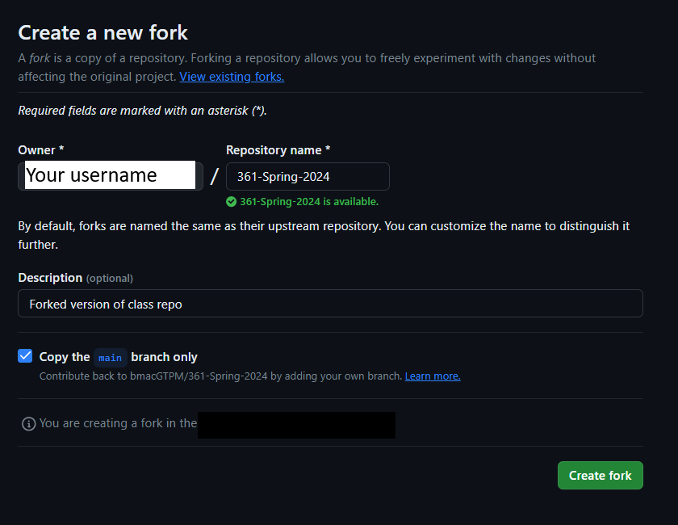
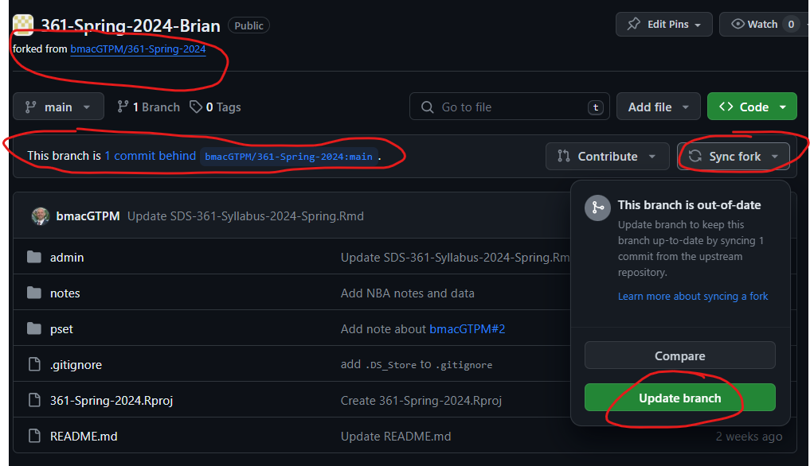
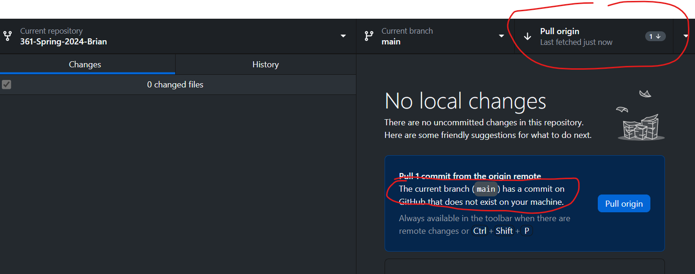

```{r setup, include=FALSE}
knitr::opts_chunk$set(echo = TRUE)
library(tidyverse)
library(pubtheme)
```

## 1. GitHub workflow

First, if you created a branch on the `bmacGTPM/361-Spring-2024` repo, 

- Make a backup copy of any work you've done on that branch. 
- Then delete your branch on the `bmacGTPM/361-Spring-2024` repo.

If you have a pull request, please close it. This might automatically be deleted if you delete your branch. 

Second, if you created a fork previously, please make sure it is private (Settings, "Change repository visibility" all the way at the bottom). If not, you may have to backup your work, delete the repo and create another fork, especially if your repo doesn't say "forked from `bmacGTPM/361-Spring-2024`" anymore.  

Going forward, there are a couple of options for using GitHub. 

Option 1: If you don't want to fully use GitHub, you can manually download files as you would with Canvas.  

Option 2: If you have cloned the repo directly (and didn't create a fork), you can continue to use that to fetch updates. Please do not create any branches, push changes, etc. there though. With this option, you can track changes to your work using Git, but you will not be able to back up your work by pushing to GitHub.

Option 3: If you want to use Git and GitHub to track changes as you work on your assignments, and back them up on GitHub, one option is to fork the repo so that you have a version of the repo on your own GitHub account.  

- Go to https://github.com/bmacGTPM/361-Spring-2024, 
- Click Fork (in the upper right), and 
- Select Create New Fork. 
- Choose your account as the destination for the fork
- Click Create Fork. 



You should now have a copy of the repo on your GitHub account. This repo should automatically be private, since you are forking a private repo.  

Now clone the repo you just created on your account to your computer. 

- Open GitHub Desktop
- Click File, New Repository
- Find the `yourGitHubUsername/361-Spring-2024` repo and select that
- Choose the local path where you want to save the repo on your computer
- Click Clone

You should now have a copy of the repo on your computer. You can open the repo in RStudio by clicking File, Open Project, and selecting the `.Rproj` file in the repo.

When changes are made on the course repo, you will see a message on your repo's main page, and you will have to update your fork. 



That updates your fork on GitHub. To update your local copy of the repo, you will have to pull the changes from the remote repo.




Most times the changes should merge with your work automatically. If there are conflicts, you will get a message about them and you may have to resolve them manually. 

Please state here which option you are using: **give option here**

# Visualizing the NBA schedule

Let's visualize how often teams play each other in a season, to better understand the structure of the NBA schedule. 

```{r}
d = readRDS('data/games.rds')
d = d %>% 
  filter(lg=='nba', season %in% 2022, season.type=='reg') %>%
  select(date, away, home, ascore, hscore, season, gid)
head(d)

dg = d %>% 
  group_by(away, home) %>%
  summarise(games = n()) %>%
  ungroup() %>%
  complete(away, home, fill=list(games=0)) ## new function! 
head(dg)
```

#### 2. Visualize the schedule with a grid plot 

Create a grid plot like the ones in these sections in the Appendix

- "Grid plot with `geom_tile`" (https://bmacgtpm.github.io/notes/grid-plot-with-geom_tile.html) 
- "Customizing with `theme`" https://bmacgtpm.github.io/notes/customizing-with-theme.html, 

except use the `pubtheme` template from https://github.com/bmacGTPM/pubtheme to make it prettier. If you need to use `theme` to rotate the axis labels, you'll need to put that line of code *after* the line with `pub`. Also, since `pub` puts the x-axis labels at the top instead of the bottom, you'll need to use `axis.text.x.top` instead of `axis.text.x`. Since the grid is 30 by 30, you should change the dimensions of your plot if necessary to make sure the grid plot looks square. 

```{r fig.height=7, fig.width=6}
## your code here
title = "Number of Games Between Each Pair of Teams" 
g = ggplot(dg, 
           aes(x    = home, 
               y    = away, 
               fill = games)) + 
  
  geom_tile(linewidth   = 0.4, 
            show.legend = T, 
            color       = pubdarkgray) +
  
  scale_fill_gradient(low      = pubgradgray,
                      high     = pubblue, 
                      na.value = pubmediumgray, 
                      oob      = squish, 
                      breaks   = c(0, 1, 2)) +

  labs(title    = title,
       x    = 'Home Team', 
       y    = 'Away Team', 
       fill = 'Games') 

g %>% 
  pub(type    = 'grid') +
  theme(axis.text.x.top = element_text(angle = 90, 
                                       vjust = .5, 
                                       hjust = 0))

```

That's fine, but the legend looks odd to me, since you can't have fractional games. Since `games` is discrete with values 0, 1, and 2, I'm going to change `games` character and use a discrete color scale. 

```{r fig.height=7, fig.width=6}
dg$games = as.character(dg$games)

title = "Number of Games Between Each Pair of Teams" 
g = ggplot(dg, 
           aes(x    = home, 
               y    = away, 
               fill = games)) + 
  
  geom_tile(linewidth   = 0.4, 
            show.legend = T, 
            color       = pubdarkgray) +
  
  scale_fill_manual(values = c(pubbackgray,  ## since I changed games to 
                               publightblue, ## character, I need to use a
                               pubblue)) +   ## discrete color scale
                                             ## the plot looks similar, but the
                                             ## legend shows discrete categories

  labs(title    = title,
       x    = 'Home Team', 
       y    = 'Away Team', 
       fill = 'Games') 

g %>% 
  pub(type    = 'grid') +
  theme(axis.text.x.top = element_text(angle = 90, 
                                       vjust = .5, 
                                       hjust = 0))

```


#### 3. Order the teams by division

By default, R organizes the teams alphabetically. But there is often additional structure in the data that is lost if we let R sort our variables alphabetically. 

There are two conferences, the Eastern Conference and Western Conference, with 15 teams each. As the names suggest, the Eastern Conference teams are in the eastern half of the United States (and one in Canada), and the Western Conference teams are in the western/midwest regions of the US.

Each conference has 3 divisions with 5 teams each.  The teams within the same division tend to be geographically close to one another.  You can read a little more about the divisions and conferences here if you'd like: https://www.lines.com/guides/what-are-the-6-nba-divisions/1572. 

NBA teams play each other more often if they are in the same division or conference. That is important structure to visualize, so let's organize teams by division. Use `factor` and specify the `levels` to be the order we want for both teams and divisions. We want, for example, the Eastern conference teams to be first, (Atlantic Division, then Central Division, and so on), followed by the Western Conference teams.  Then make a grid plot with the new ordering. 

Some data prep is done for you below. 

```{r}
tms = read.csv('data/nba.teams.csv')

## capitalize the first letter of each conf and div
## create a factor to specify the order we want for divisions
tms = tms %>% 
  arrange(conf, div) %>%
  mutate(conf = paste0(toupper(substr(conf, 1, 1)), 
                               substr(conf, 2, nchar(conf))),
         
         div  = paste0(toupper(substr(div , 1, 1)), 
                               substr(div , 2, nchar( div))), 

         div  = factor(div, 
                       levels = unique(div))) 
head(tms)

## your code here

## save the teams in the order they appear in the tms data frame
## so we can use it to specify the order of the teams in the plot
## note that tms is sorted by conf and div
teams.order = tms %>% 
  select(team) %>% 
  unlist()
head(teams.order)

dg2 = dg %>%
  
  ## add columns for the division of home and away team
  left_join(tms %>% select(team, div), 
            by = c('home' = 'team')) %>%
  left_join(tms %>% select(team, div), 
            by = c('away' = 'team'), 
            suffix = c('.h', '.a')) 
  

  ## specify order we want the teams in. This has to be done
  ## after the above code, because the above code turns
  ## `away` and `home` into character vectors
dg2 = dg2 %>%
  mutate(away = factor(away, levels = rev(teams.order)), 
         home = factor(home, levels = teams.order))

head(dg2)


```


```{r fig.height=7, fig.width=6}
## your code here

## the same/similar ggplot code from previous question might work here too, 
## depending what you did there

title = "Number of Games Between Each Pair of Teams" 
g = ggplot(dg2, 
           aes(x    = home, 
               y    = away, 
               fill = games)) + 
  
  geom_tile(linewidth   = 0.4, 
            show.legend = T, 
            color       = pubdarkgray) +
  
  scale_fill_manual(values = c(pubbackgray,  ## since I changed games to 
                               publightblue, ## character, I need to use a
                               pubblue)) +   ## discrete color scale
                                             ## the plot looks similar, but the
                                             ## legend shows discrete categories

  labs(title    = title,
       x    = 'Home Team', 
       y    = 'Away Team', 
       fill = 'Games') 

g %>% 
  pub(type    = 'grid') +
  theme(axis.text.x.top = element_text(angle = 90, 
                                       vjust = .5, 
                                       hjust = 0))


```

#### 4. Creating separation between the divisions

That looks a lot more orderly! We are starting to see the structure of the data. Now let's do one more thing and create some separation between the divisions. Use `facet_grid` to facet by division. Some data prep is done for you below. Note that `facet_grid` is similar to `facet_wrap` but requires you to specify two columns. See also the Arguments described in the help file. You'll need to use at least one of the arguments to make this look nice. 


```{r fig.height=7, fig.width=6}
## your code here

## if you didn't use left_join above in the previous question 
## to create columns for the division of home and away team,
## you will have to do it here

  # ## add columns for the division of home and away team
  # left_join(tms %>% select(team, div), 
  #           by = c('home' = 'team')) %>%
  # left_join(tms %>% select(team, div), 
  #           by = c('away' = 'team'), 
  #           suffix = c('.h', '.a')) 
  # 


title = "Number of Games Between Each Pair of Teams" 
g = ggplot(dg2, 
           aes(x = home, 
               y = away, 
               fill = games)) +
  
  geom_tile(linewidth = 0.4, 
            show.legend = T, 
            color = pubdarkgray) + 
  
  facet_grid(div.a ~ div.h,    ## now faceting by division
             scales = 'free')+ ## need this so that only the relevant teams 
                               ## show up in each facet

  scale_fill_manual(values = c(pubbackgray,  ## since I changed games to 
                               publightblue, ## character, I need to use a
                               pubblue)) +   ## discrete color scale
  
  labs(title = title,
       x = 'Home Team', 
       y = 'Away Team', 
       fill = 'Games') 
  
g %>%
  pub(type = 'grid', 
      base_size = 36/4) + ## use smaller text so names fit better
  theme(axis.text.x.top = element_text(angle = 90, 
                                       vjust = .5, 
                                       hjust = 0),  
        
        ## we can adjust the panel spacing a little bit, if desired, and 
        ## makes the legend look like squares instead of rectangles, if desired
        panel.spacing     = unit(1/72*10/4, "in"), 
        legend.key.width  = unit(1/72*36/4, "in"))
        
        
```


## 5. Create a new repo 
Create a new repo (on GitHub.com go to Repositories, New) on your GitHub account called `Visualizations`. Make it public. Initialize it with a README. Add a `.gitignore` file and use the `R` template. Choose any licence or none. Clone the repo to your computer. Save the visualization you created in #4 to a file in this repo on your computer. Commit the change to the main branch. Push the commit to GitHub. Take a screenshot of the repo on GitHub showing that it has your visualization file in it. Paste the screenshot below.  

**paste screenshot here**

GitHub is a good place to showcase your work to potential employers, graduate school programs, and peers. Similar to an artist who has a portfolio, you can have a data science portfolio. You can continue to add visualizations to this repo, or create another repo to publicly showcase data science projects and other work that you do. 


