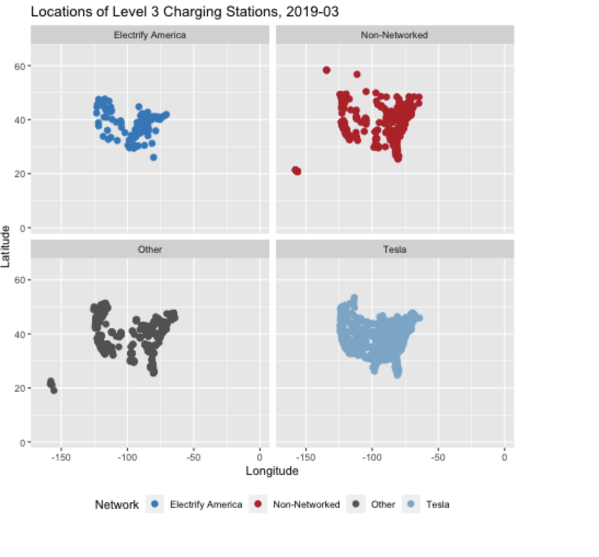

```{r setup, include=FALSE}
knitr::opts_chunk$set(echo = TRUE)
library(tidyverse)
library(pubtheme)
library(MASS, exclude = 'select')
library(GGally)
library(leaflet)
library(htmltools)
library(gganimate)

```


## Maps

### 1. EV charging station locations

```{r}
d = readRDS('data/EVstations.rds')
colnames(d) = tolower(colnames(d))

d = d %>%
  select(-matches('cng|lng|lpg|hydrogen|e85|bd[.]blends|french|^ng[.]|plus4|level1')) %>%
  filter(fuel.type.code=='ELEC') %>%
  rename(lev2=ev.level2.evse.num, 
         lev3=ev.dc.fast.count, 
         network = ev.network, 
         lat = latitude, 
         lon = longitude) %>%
  mutate(status = case_when(status.code=='E' ~ 'avail', 
                            status.code=='P' ~ 'planned', 
                            status.code=='T' ~ 'temp.unavail', 
                            TRUE ~ ''), 
         lev2 = ifelse(is.na(lev2), 0, lev2), 
         lev3 = ifelse(is.na(lev3), 0, lev3)) %>%
  mutate(network = ifelse(network=='Tesla Destination', 'Tesla', network), 
         network = gsub('é', 'E', network), 
         network = gsub('É', 'E', network))
  
```

Plot the locations of Level 3 Charging Stations and this time make sure we can easily distinguish what network each charging station belongs to.  Consider the top 5 networks (Tesla, Electrify America, ChargePoint, eVgo, and Non-Networked)  separately and group all other networks together as "Other". 


```{r}
## group all other networks together as "Other"

d = d %>%
  mutate(network = case_when(network %in% c('Tesla', 'Electrify America', 'ChargePoint', 'eVgo', 'Non-Networked') ~ network, 
                             TRUE ~ 'Other'))

## find lev3 stations

dd = d %>% filter(lev3>0)

g1 <- ggplot(dd, aes(x = lon, y = lat, color = as.factor(network))) +
  geom_point() +
  labs(title = "Locations of Level 3 Charging Stations",
       x = "Longitude",
       y = "Latitude",
       color = "Network") +
  theme(legend.position = "bottom")

g1
```


### 2. Animation

Make a plot like above but facet by network, and animate it using `open.date` as the time variable.  Since there are ~1458 unique `open.dates`, we probably don't want one frame per date. So create a month column and use one frame per month. When a charging station appears, we want it to stay for the rest of the animation (not go away the next month). Upload your `gif` to Gradescope in the assignment denoted "GIF", and at the end of your code below, include a screenshot of the animation taken sometime halfway through the animation. Tip for knitting your PDF: as discussed in class, comment out your `animate` code after creating a `.gif` so that your document knits more quickly. 

**Code**

```{r}
## create a month column

dd = dd %>%
  mutate(open.date = as.Date(open.date), 
         month = format(open.date, '%Y-%m'))

## create the animation facetting by network

g2 <- ggplot(dd, aes(x = lon, y = lat, color = as.factor(network))) +
  geom_point() +
  theme(legend.position = "bottom") +
  facet_wrap(~network)

a = g2 + 
  transition_states(month) + 
  shadow_mark(past = TRUE, future = FALSE) + 
  labs(title = "Locations of Level 3 Charging Stations, {closest_state}",
       x = "Longitude",
       y = "Latitude", 
       color = "Network")

# anim_save("problem2.gif", a, 
#         duration = 15, width = 800, height = 600)
```


**Screenshot here**



### 3. Interactive Plot

Plot EV charging station locations on an interactive map with `leaflet`. Create labels that show the EV network, station name, street address, city, state, zip, and the number Level 2 and Level 3 charging stations. Size the dots by the number of chargers at that location. Since your computer might have issues showing all the points at once, plot just the locations in CT. 

```{r}

## plot just the locations in CT

ddd = d %>% filter(state=='CT')

## create the leaflet map

leaflet(ddd) %>%
  addTiles() %>%
  addCircleMarkers(lng = ~lon, lat = ~lat,
                   radius = ~(lev2 + lev3), 
                   color = ~network, 
                   popup = ~paste(network, '<br>',
                                  station.name, '<br>',
                                  street.address, '<br>',
                                  city, state, zip, 
                                   'Level 2: ', lev2, '<br>',
                                  'Level 3: ', lev3)) 

```


## Shiny

### 4. Basic Shiny App
Do the following to create a basic shiny app and publish it to shinyapps.io

- Configure R Studio to communicate with shinyapps.io by following the directions from this page https://shiny.rstudio.com/articles/shinyapps.html up to and including the "Method 1" section. You will show you how to install `rsconnect`, create a shinyapps.io account, and set up communication between R Studio and shinyapps.io. Note that you will only have to do this once. 
- Create a new shiny app like we did in class by clicking File, New File, Shiny Web App. Name the app `hw03app1`, choose Single File, choose an appropriate directory, and click Create. An `app.R` file will open in R Studio. 
- Click Run App to see the app. The app should appear in the Viewer tab in R Studio, or in its own window.
- In the upper right of the app, click Publish. Make sure the correct files and account are selected. Click Publish in the lower right. 

Paste the url for your app here. The url will be of the form 
https://yourusername.shinyapps.io/yourappname/

**url here**

https://langchenliu.shinyapps.io/hw03app1/


### 5. Shiny App for EV Charging Stations

Create a Shiny app that contains a leaflet map like in #3 and allows the user to select 

- a state (default: CT)
- a date range (default: 2015-01-01 to present)
- a network (default: all networks), and 
- Level 2 or Level 3 (default: Level 3) 

and displays a leaflet plot of Level 2 or 3 EV charging stations for that `state`, for that `network`, and with an `open.date` in that date range. Note that you will have to copy the `EVstations.rds` file to the folder that contains the Shiny app. 

Different types of user inputs can be found here https://shiny.rstudio.com/gallery/widget-gallery.html

Publish your shiny app to shinyapps.io, and paste the url for your app here: 

**url here**

https://langchenliu.shinyapps.io/leaflet-EVstations-map/

## Bootstrapping s.e. for $\hat{\lambda}$


```{r}
dc = readRDS('data/tracts.and.census.with.EV.stations.rds')
dc = dc@data ## keep just the data frame, not the polygons

dc = dc %>% 
  
  ## Change NAs to 0s, and 
  ## since charging stations seem to come in pairs, create new columns
  ## for pairs of charging stations
  mutate(lev2 = ifelse(is.na(lev2), 0, lev2), 
         lev3 = ifelse(is.na(lev3), 0, lev3), 
         lev2pairs = round(lev2/2),
         lev3pairs = round(lev3/2)) %>%
  
  ## Keep tracts with at least one charging station, 
  ## and get rid of a couple of outliers
  #filter((lev2!=0 | lev3!=0) & lev2<=50) %>%
  mutate(log.house.value = log(house.value))

```

### 6. s.e. for $\hat{\lambda}$, all observations

In class we found the bootstrap s.e. for $\hat{\lambda}$ when `log.house.value = 12`. Find the bootstrap s.e. for all values of `log.house.value` in the data. Hint: long format for a data frame is your friend. The s.e. for some values of `log.house.value` are small and some are large. Why?


```{r}
# create a dataframe with all unique values of log.house.value

dp = data.frame(log.house.value=unique(dc$log.house.value))
dp <- dp %>% drop_na()

## dp is used to feed into the regression model

## Set the random seed
set.seed(1)
Bootrounds <- 100

## Create a data frame to store the coefficients and predictions
boot.results = data.frame(b=(rep(1:Bootrounds, each = nrow(dp))), 
                          coef=NA, 
                          log.lambdahat=NA, 
                          log.house.value = rep(dp$log.house.value, times = Bootrounds)) 

for (b in 1:Bootrounds){
  
  rows = sample(x=1:nrow(dc), size = nrow(dc), replace = T)
  
  ## create bootstrap sample
  db = dc[rows,]
  
  ## fit the model 
  m1 = glm(lev2 ~ log.house.value, data = db, family='poisson')
  
  ## record coefficients and predictions
  boot.results$coef[boot.results$b == b] = coef(m1)[2]
  boot.results$log.lambdahat[boot.results$b == b] = 
    predict(m1, newdata = dp, type = 'link')
  
}

# find lambdahat
boot.results$lambdahat = exp(boot.results$log.lambdahat)

dddd <- boot.results %>% 
  group_by(log.house.value) %>% 
  summarize(log.house.value = mean(log.house.value),
            bootstrap.lambdahat = mean(lambdahat), 
            bootstrap.se = sd(lambdahat))

g3 <- ggplot(dddd, aes(x = log.house.value, y = bootstrap.se)) + 
  geom_point() + 
  labs(title = "Standard Error of Lambda from Bootstrap", 
       x = "log(House Value)", 
       y = "Standard Error of Lambda")
g3

```

The s.e. increases as the number of charging stations increases. This is because the variance of the Poisson distribution is equal to the mean, so the s.e. of the mean increases as the mean increases. To verify this, we can plot the s.e. against the mean. 

```{r}

g4 <- ggplot(dddd, aes(x = bootstrap.lambdahat, y = bootstrap.se)) + 
  geom_point() + 
  labs(title = "Standard Error of Lambda from Bootstrap", 
       x = "Lambda Hat", 
       y = "Standard Error of Lambda")

g4

```

I think this explains a lot.


### 7. Compare s.e. with bootstrapped s.e.

Plot $\hat{\lambda} + 2 \, s.e.$ and $\hat{\lambda} - 2 \, s.e.$ along with the curve for $\hat{\lambda}$, and $\pm 2 \,s.e.$ that you get from using `predict(glm1, newdata = dc, type = 'response', se.fit = T)` from the Poisson (`glm1`), Quasipoisson (`glm2`) and Negative binomial (`glm3`) models. Compare the results. 

```{r}

# build glm1, glm2, and glm3
glm1 = glm(lev2 ~ log.house.value, data=dc, family='poisson')
glm2 = glm(lev2 ~ log.house.value, data=dc, family='quasipoisson')
glm3 = glm.nb(lev2 ~ log.house.value, data=dc)

# predict lambdahat and se from glm1, glm2, and glm3
dddd$poisson.lambdahat = predict(glm1, newdata = dddd, type = 'response')
dddd$poisson.se = predict(glm1, newdata = dddd, type = 'response', se.fit = T)$se.fit
dddd$quasipoisson.lambdahat = predict(glm2, newdata = dddd, type = 'response')
dddd$quasipoisson.se = predict(glm2, newdata = dddd, type = 'response', se.fit = T)$se.fit
dddd$negbin.lambdahat = predict(glm3, newdata = dddd, type = 'response')
dddd$negbin.se = predict(glm3, newdata = dddd, type = 'response', se.fit = T)$se.fit

# plot 
g5 <- ggplot(dddd, aes(x = log.house.value)) + 
  geom_line(aes(y = bootstrap.lambdahat, color = "Bootstrap"), linewidth = 1) + 
  geom_line(aes(y = poisson.lambdahat, color = "Poisson"), linewidth = 1) + 
  geom_line(aes(y = quasipoisson.lambdahat, color = "Quasipoisson"), linewidth = 1) + 
  geom_line(aes(y = negbin.lambdahat, color = "Negative Binomial"), linewidth = 1) + 
  geom_ribbon(aes(ymin = bootstrap.lambdahat - 2*bootstrap.se, 
                  ymax = bootstrap.lambdahat + 2*bootstrap.se), 
              fill = "yellow", alpha = 0.2) + 
  geom_ribbon(aes(ymin = poisson.lambdahat - 2*poisson.se, 
                  ymax = poisson.lambdahat + 2*poisson.se), 
              fill = "red", alpha = 0.2) + 
  geom_ribbon(aes(ymin = quasipoisson.lambdahat - 2*quasipoisson.se, 
                  ymax = quasipoisson.lambdahat + 2*quasipoisson.se), 
              fill = "green", alpha = 0.2) + 
  geom_ribbon(aes(ymin = negbin.lambdahat - 2*negbin.se, 
                  ymax = negbin.lambdahat + 2*negbin.se), 
              fill = "purple", alpha = 0.2) + 
    scale_color_manual(name = "color", 
                     values = c("Bootstrap" = "yellow", 
                                "Poisson" = "red", 
                                "Quasipoisson" = "green", 
                                "Negative Binomial" = "purple")) + 
  labs(title = "Comparison of Bootstrap, Poisson, Quasipoisson, and Negative Binomial Models", 
       x = "log(House Value)", 
       y = "Lambda") + 
  theme(legend.position = "bottom")

g5

```


The four models are very similar, all of the model has s.e. increasing as log.house.value increasing. But the Poisson model has the smallest s.e. and the Bootstrap model has the largest s.e. The Quasipoisson model and the Negative binomial model are in between. The Negative binomial model has the largest mean of $\hat{\lambda}$, and the Poisson model has the smallest $\hat{\lambda}$.


## Bootstrapping

Suppose that we obtain a bootstrap sample from a set of $n$ observations. We will now show that the probability that the $j$th observation is part of a bootstrap sample is 0.632 for large enough $n$.

### 8. 1st and 2nd observation are in the sample

What is the probability that the 1st bootstrap observation is *not* the $j$th observation from the original sample?  The 2nd bootstrap observation?

**The 1st bootstrap observation being the $j$-th observation has probability $1/n$, so the negation has $\frac{n-1}{n}$. The 2nd bootstap observation will still has the same $\frac{n-1}{n}$ probability of not being the $j$-th observation because bootstrap will replace the drawn sample each time.**


### 9. jth observation is not in the sample

Argue that the probability that the $j$th observation is *not* in the bootstrap sample is $(1 - 1/n)^n$.

From problem 8, we know that $\forall j$, the $j$-th boot will not be in the sample with probability $\frac{n-1}{n}$. So the probability that the $j$-th observation is not in the bootstrap sample is $(1 - 1/n)^n$ due to independence of bootstrap rounds.


### 10. jth observation is in the sample

What is the probability that the $j$th observation *is* in the bootstrap sample? Find the limit of your answer as $n\rightarrow \infty$. Argue that for large enough $n$, the probability that the $j$th observation is in the bootstrap sample is around 0.632.

**The probability that the $j$th observation is in the bootstrap sample is $1 - (1 - 1/n)^n$. As $n\rightarrow \infty$, the limit of this probability is $1 - e^{-1} \approx 0.632$.**


